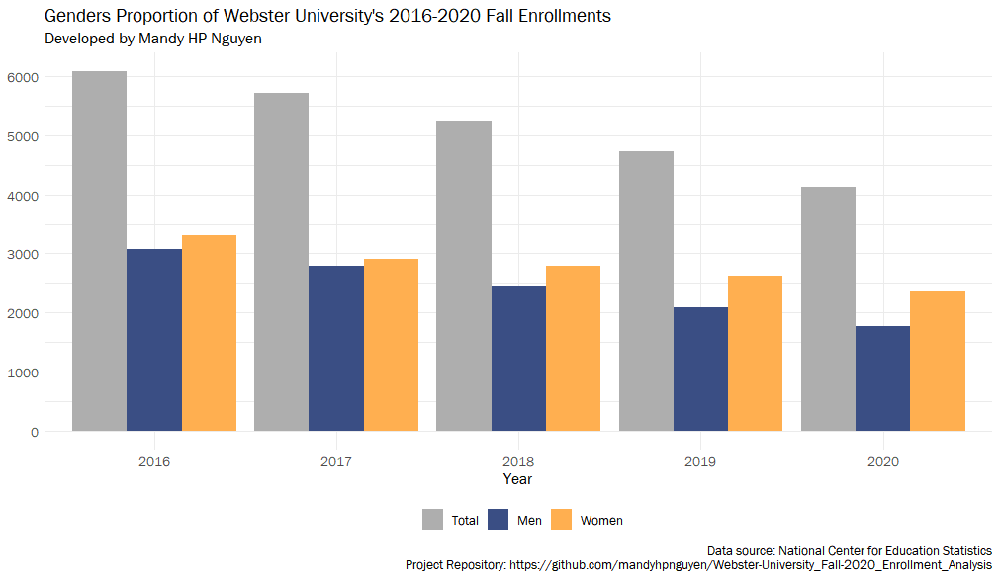
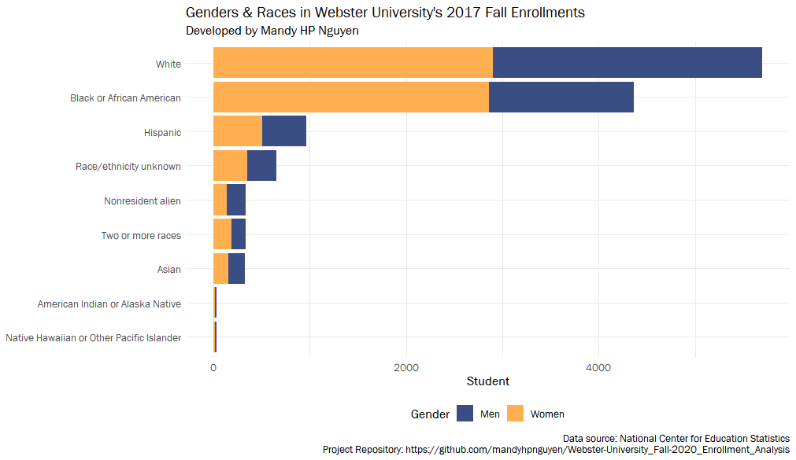

<!-- HEADER -->

  <h1>Webster University's Fall 2020 Enrollment Data Analysis</h1>
  
<strong>developed by Mandy HP Nguyen</strong>

  
I just want to learn how my school was doing last year, 2020

  

    <a href="https://github.com/mandyhpnguyen/Webster-University_Fall-2020_Enrollment_Analysis" target="_blank">
      <strong><< Project's GitHub >></strong>
    </a>
    <a href="https://github.com/mandyhpnguyen/Webster-University_Fall-2020_Enrollment_Analysis/blob/main/2021_websteru_enroll_analysis_mandy-hp-nguyen.pdf">
      <strong><< Analysis Paper >></strong>
    </a>
  

## Descriptive Analysis

## References:

- National Center for Education Statistics - [link](https://nces.ed.gov/ipeds/use-the-data)
- Integrated Postsecondary Education Data System - [link](https://nces.ed.gov/ipeds/use-the-data)
- Webster University's Our Editorial Style — Color Palette & Typography - [link](https://webster.edu/website-training-resources/editorial-style-color-palette.php)
